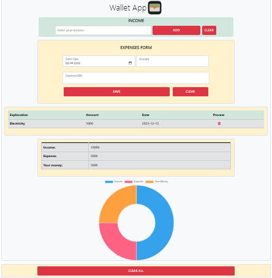

# Buget Manager App

A simple budget manager app to track income and expenses, calculate remaining balance, and visualize the data with charts.

## ScreenShot

## Technologies

**HTML (20%):** The structural framework of the app is created with HTML. Elements like forms, tables, and buttons are structured using HTML.

**CSS (20%):** The visual layout and styling of HTML elements are handled with CSS. Responsive design, colors, fonts, and overall style features are adjusted using CSS.

**JavaScript (40%):** The dynamic functionalities of the app are written in JavaScript. It processes income and expense data, uses local storage, updates data, dynamically alters the interface, and draws charts.

**LocalStorage (10%):** Local storage is used to store application data. Income and expense data entered by the user are saved and loaded using localStorage.

**Chart.js (10%):** This library is used to visually represent income and expense data. It adds a graphical visualization to the app, making the data easier for users to understand.

## FlowChart

- A[START] --> B[User Input]
- B --> C[Add Income]
- C --> D[Update Total Income]
- D --> E[Store in LocalStorage]
- B --> F[Add Expense]
- F --> G[Update Expense List]
- G --> H[Update Total Expense]
- H --> I[Store in LocalStorage]
- B --> J[Update UI]
- J --> K[Update Table]
- K --> L[Update Remaining Budget]
- L --> M[Draw Chart]
- M --> N[END]
